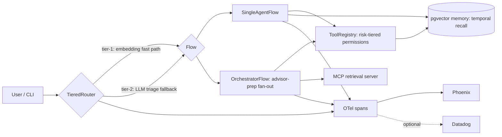

# fable-harness


**The harness, not the model, is where the value lives.**

A thin-harness-with-thick-seams AI agent runtime — router, memory, tools, retrieval,
and telemetry each a swappable Python `Protocol`, not baked into one framework. Built
on Pydantic AI 2.x, Postgres+pgvector, MCP, and OTel — and, unusually for a repo this
size, actually verified end-to-end rather than just scaffolded: real traces in Phoenix,
real risk-tiered permission denials, real ablation deltas, 18 passing evals against a
real model and real embeddings.

## Why this is different

- **Every seam is swappable.** Router, memory, tools, retrieval, and telemetry are
  Python `Protocol`s — the embedding backend alone was swapped (local → OpenAI) as a
  same-session change touching one factory function.
- **Ablations are proven, not assumed.** `evals/ablations.py` toggles memory/critic
  on and off and asserts the exact behavioral delta (e.g. critic_on adds exactly one
  agent call) — not a claim, a passing test.
- **Permissions fail closed.** A `financial`-tier tool call with no approval gate is
  denied by default; the approval path is exercised end-to-end, not just documented.
- **PII has a double guard.** Content capture is off by default at the source, and a
  collector-side redaction processor strips anything that slips through — verified by
  deliberately leaking an email/API-key-shaped string and confirming it never reaches
  the exported span.
- **The eval suite is (almost) free.** 18 tests run against Pydantic AI's `TestModel`
  with zero token spend; only the routing-accuracy eval touches a real API, and it
  skips cleanly without a key.

## Quickstart

```bash
cp .env.example .env        # fill in HARNESS_ANTHROPIC_API_KEY + HARNESS_OPENAI_API_KEY (embeddings)
uv sync                     # install deps (add --extra eval for DeepEval/Ragas/pytest)
docker-compose up -d        # postgres (pgvector), otel-collector, phoenix

uv run harness "prep me for my meeting with client X"

open http://localhost:6006  # Phoenix UI — inspect gen_ai.* / harness.* spans
```

Run the eval suite (LLM-free, uses Pydantic AI `TestModel`/`FunctionModel` — the one
exception is `test_router.py`'s tier-1 routing-accuracy test, which makes real OpenAI
embeddings calls and skips cleanly if `OPENAI_API_KEY`/`HARNESS_OPENAI_API_KEY` isn't set):

```bash
uv run pytest
```

## Architecture



## Layout

```
harness/
  core/       agent loop, budgets, permissions, session, context
  routing/    tiered router (semantic-router fast path + LLM triage fallback)
  tools/      tool registry (risk tiers) + MCP client
  memory/     pgvector-backed MemoryStore with temporal invalidation
  retrieval/  stub MCP retrieval server (keyword search; swap for LlamaIndex later)
  flows/      single-agent tool loop + orchestrator-workers advisor-prep flow
  telemetry/  OTel GenAI instrumentation + collector config (redaction, dual export)
  evals/      golden datasets + DeepEval/Ragas suites + ablation runner
  config/     settings (.env via pydantic-settings) + harness.yaml
```

See `.claude/plans` history or ask the assistant for the full design rationale —
this MVP tracks a research brief on 2026 agent-harness architecture.

## Python environment

This project uses [`uv`](https://docs.astral.sh/uv/) for all tooling —
`uv sync`, `uv add`, `uv run`. Do not use bare `pip`/`python`.
